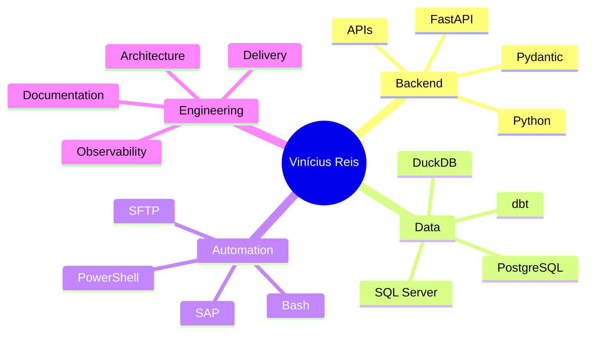

<p align="center">
  
</p>

<p align="center">
  
</p>

<h1 align="center">Vinícius Reis</h1>

<h3 align="center">
  Python Backend Developer • Data Engineering • API Automation
</h3>

<p align="center">
  <a href="mailto:viniciussport2004@gmail.com">
    
  </a>
  <a href="https://www.linkedin.com/in/vin%C3%ADcius-gon%C3%A7alves-reis-4544a921a?lipi=urn%3Ali%3Apage%3Ad_flagship3_profile_view_base_contact_details%3BeOlF79HGQICtD6MUyPINQQ%3D%3D">
    
  </a>
  <a href="https://github.com/venysssssssssss">
    
  </a>
</p>

<p align="center">
  
</p>

---

## `whoami`

```python
class ViniciusReis:
    role = "Backend Developer & Data Engineering Student"
    main_stack = [
        "Python",
        "FastAPI",
        "PostgreSQL",
        "SQL Server",
        "DuckDB",
        "dbt",
        "Linux",
        "Docker",
    ]
    interests = [
        "APIs",
        "automation",
        "data pipelines",
        "backend architecture",
        "RAG",
        "developer tooling",
    ]
    mindset = "Build systems that are clear, auditable, scalable and hard to break."
```

I build backend and data systems focused on **automation**, **API design**, **data extraction**, **pipeline reliability** and **operational intelligence**.

My work lives between software engineering and data engineering: turning manual, fragile and repetitive processes into structured, traceable and production-oriented systems.

---

## Engineering Focus

<table>
  <tr>
    <td width="50%">
      <h3>Backend & APIs</h3>
      <p>
        FastAPI services, REST APIs, async flows, Pydantic validation, modular architecture,
        service layers, background jobs and production-ready interfaces.
      </p>
    </td>
    <td width="50%">
      <h3>Data Engineering</h3>
      <p>
        ETL/ELT pipelines, DuckDB processing, SQL Server/PostgreSQL integrations,
        dbt modeling, data quality rules and analytical outputs.
      </p>
    </td>
  </tr>
  <tr>
    <td width="50%">
      <h3>Automation</h3>
      <p>
        Python automation, SAP-related extraction flows, SFTP ingestion,
        batch processing, PowerShell/Bash scripts and operational tooling.
      </p>
    </td>
    <td width="50%">
      <h3>AI & Knowledge Systems</h3>
      <p>
        RAG architectures, vector search, technical documentation, knowledge bases,
        LLM-assisted workflows and data-driven internal tools.
      </p>
    </td>
  </tr>
</table>

---

## Tech Arsenal

<p align="center">
  
</p>

<div align="center">

| Area | Tools |
|---|---|
| **Backend** | Python, FastAPI, Pydantic, Uvicorn, REST APIs |
| **Data** | DuckDB, dbt, pandas, SQLAlchemy, PostgreSQL, SQL Server |
| **Automation** | Paramiko, SFTP, SAP GUI Scripting, pywinauto, PowerShell, Bash |
| **Dev Environment** | Poetry, pyenv, Git, GitHub, Linux, Windows, Docker |
| **Architecture** | ELT, API-first systems, batch jobs, audit logs, modular services |
| **AI/Data Apps** | RAG, vector search, knowledge bases, LLM-assisted automation |

</div>

---

## Current Direction

```txt
> Building practical systems for real operational problems.
> Less noise. More architecture. More automation. More delivery.
```

- Designing APIs that are simple to consume and hard to misuse.
- Building data pipelines with validation, reproducibility and auditability.
- Replacing manual business flows with reliable automation.
- Studying software engineering, data science and scalable backend architecture.
- Improving developer workflows with documentation, CLI tooling and AI-assisted systems.

---

## GitHub Analytics

<p align="center">
  
  
</p>

<p align="center">
  
</p>

<p align="center">
  
</p>

---

## What I Like to Build

<div align="center">

| Type | Description |
|---|---|
| **API Control Planes** | Backend services to trigger, monitor and audit automation flows |
| **Data Extraction Engines** | Pipelines that collect, normalize and persist operational data |
| **Analytical Backends** | Materialized datasets, reports, snapshots and business-rule engines |
| **Automation Runners** | Scripts/services that execute repetitive work with traceability |
| **Knowledge Systems** | RAG-based tools, documentation workflows and searchable technical memory |

</div>

---

## Operating Principles

```txt
Readable code > clever code
Traceability > blind execution
Architecture > patchwork
Automation > repetition
Delivery > perfectionism
```

---

## Stack DNA



---

## Connect

<p align="center">
  <a href="mailto:viniciussport2004@gmail.com">
    
  </a>
</p>

<p align="center">
  <a href="https://www.linkedin.com/in/vin%C3%ADcius-gon%C3%A7alves-reis-4544a921a?lipi=urn%3Ali%3Apage%3Ad_flagship3_profile_view_base_contact_details%3BeOlF79HGQICtD6MUyPINQQ%3D%3D">
    
  </a>
</p>

---

<p align="center">
  
</p>

<p align="center">
  
</p>
