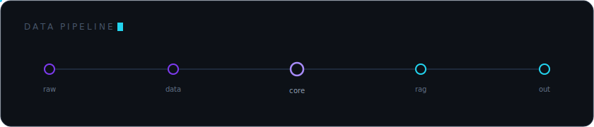
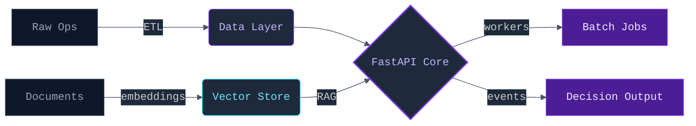

<div align="center">



</div>

<div align="center">

# Vinícius Reis

<p>
  <a href="https://github.com/Tekhnai">
    
  </a>
  &nbsp;
  <a href="https://venys.vercel.app">
    
  </a>
  &nbsp;
  <a href="https://www.linkedin.com/in/vinícius-gonçalves-reis-4544a921a">
    
  </a>
  &nbsp;
  <a href="mailto:viniciussport2004@gmail.com">
    
  </a>
  &nbsp;
  
</p>

<sub><i>clarity > cleverness &nbsp;·&nbsp; architecture > patchwork &nbsp;·&nbsp; systems that outlast the sprint</i></sub>

</div>

<br/>

> I turn fragile manual workflows into **auditable, observable software**.  
> APIs with strict contracts. Pipelines with lineage. Automation with receipts.

## Surface

Four load-bearing pillars — operational scopes where I take full-stack ownership.

**`Backend Systems`** — Production interfaces built for operators, not demos. Resilient APIs, async task runners, service-layer separation, strict validation contracts. **FastAPI**, **Rust**.

**`Data Infrastructure`** — Clean analytical pipelines from raw to decision-ready. SQL modeling, schema enforcement, incremental ingestion, quality gates. **dbt**, **DuckDB**, **PostgreSQL**.

**`Applied AI & Search`** — Friction-free AI infrastructure: **RAG** architectures, document pipelines, vector search with **Qdrant**, local LLM orchestration.

**`Operational Automation`** — Brittle routines replaced by auditable software. Extraction engines, SFTP ingestion, SAP/ClickUp/Grafana integrations, scheduled jobs via **Bash** and **PowerShell**.

## Architecture

<div align="center">

</div>

<details>
<summary><b>↳ precise topology</b> &nbsp;<sub>(the wiring, expanded)</sub></summary>
<br/>



</details>

## Stack

<div align="center">

</div>

<details>
<summary><b>↳ full toolchain</b> &nbsp;<sub>(every package, enumerated)</sub></summary>
<br/>
<div align="center">

<sub><b>L A N G U A G E S</b></sub>
<br/>

&nbsp;

&nbsp;

&nbsp;

&nbsp;


<br/><br/>

<sub><b>D A T A</b></sub>
<br/>

&nbsp;

&nbsp;

&nbsp;


<br/><br/>

<sub><b>B A C K E N D</b></sub>
<br/>

&nbsp;

&nbsp;

&nbsp;


<br/><br/>

<sub><b>T O O L I N G</b></sub>
<br/>

&nbsp;

&nbsp;

&nbsp;


</div>
</details>

## Signal

<sub>This panel is <b>self-generated</b> — a GitHub Action recomputes it daily from my live repo data. The profile is itself a pipeline.</sub>

<div align="center">

</div>

<details>
<summary><b>$ neofetch</b> &nbsp;<sub>(system specs)</sub></summary>

```
        ⬡ ⬡ ⬡           venys@tekhnai
      ⬡       ⬡         ──────────────────────────────────────
     ⬡  ▟█▙   ⬡         role    ▸  CEO / CTO · backend & data systems
     ⬡  ▜█▛   ⬡         os      ▸  Kali Linux · WSL2 · Windows
      ⬡       ⬡         shell   ▸  zsh · tmux · nvim
        ⬡ ⬡ ⬡           lang    ▸  Python · Rust · SQL
                        stack   ▸  FastAPI · dbt · DuckDB · Qdrant
                        infra   ▸  Docker · Redis · Celery · Grafana
                        focus   ▸  raw ops ─→ decision systems
                        uptime  ▸  shipping since 2021
                        ───────────────────────────────────────
                        ▓▓▓▓▓▓▓▓▓▓▓▓▓▓▓▓▓▓▓▓  violet · cyan
```

</details>

<br/>

<div align="center">
<sub><code>Build systems that outlast the engineer who wrote them.</code></sub>
</div>
