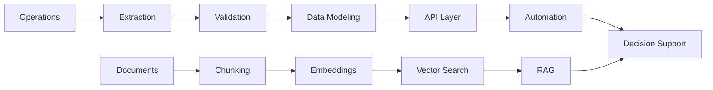

<p align="center">
  
</p>

<p align="center">
  
</p>

<p align="center">
  <a href="mailto:viniciussport2004@gmail.com">
    
  </a>
  <a href="https://www.linkedin.com/in/vin%C3%ADcius-gon%C3%A7alves-reis-4544a921a?lipi=urn%3Ali%3Apage%3Ad_flagship3_profile_view_base_contact_details%3BeOlF79HGQICtD6MUyPINQQ%3D%3D">
    
  </a>
  <a href="https://github.com/venysssssssssss">
    
  </a>
</p>

<p align="center">
  
</p>

---

```txt
I build systems where backend engineering, data architecture and automation meet.

My work is focused on APIs, extraction engines, analytical backends,
workflow automation, AI-assisted knowledge systems and operational software
that needs to be clear, traceable and hard to break.
```

---

## Engineering Surface

<table>
  <tr>
    <td width="50%">
      <h3>Backend Systems</h3>
      <p>
        API-first services, FastAPI applications, service layers, runners,
        control planes, validation contracts and production-oriented interfaces.
      </p>
    </td>
    <td width="50%">
      <h3>Data Infrastructure</h3>
      <p>
        DuckDB pipelines, SQL modeling, dbt workflows, analytical datasets,
        spreadsheet validation, data quality rules and materialized outputs.
      </p>
    </td>
  </tr>
  <tr>
    <td width="50%">
      <h3>Automation</h3>
      <p>
        Python automation, SFTP ingestion, SAP-related flows, batch jobs,
        PowerShell/Bash tooling and operational process replacement.
      </p>
    </td>
    <td width="50%">
      <h3>AI Systems</h3>
      <p>
        RAG architectures, Qdrant vector search, document processing,
        local LLM services and knowledge-base engineering.
      </p>
    </td>
  </tr>
</table>

---

## System DNA



---

## Stack

<p align="center">
  
</p>

```txt
Python      FastAPI      DuckDB       dbt          PostgreSQL
SQL Server  Docker       Linux        Git          PowerShell
SFTP        APIs         RAG          Qdrant       Automation
```

---

## Work Direction

| Axis | What I design |
|---|---|
| **Backend** | APIs, runners, service layers, async flows, control planes |
| **Data** | ELT pipelines, validation layers, materialized datasets |
| **Automation** | extraction engines, batch processing, operational tooling |
| **AI** | RAG systems, local LLM workflows, document intelligence |
| **Documentation** | Markdown-first technical memory for long-term maintainability |

---

## Selected Systems

| Project | Signal |
|---|---|
| [`knowledge-base-refac`](https://github.com/venysssssssssss/knowledge-base-refac) | AI knowledge base with document processing, RAG services, Qdrant and Mistral-oriented architecture |
| [`verihfy`](https://github.com/venysssssssssss/verihfy) | corporate text correction platform with local AI services, authentication, PostgreSQL and modular APIs |
| [`clickup-api`](https://github.com/venysssssssssss/clickup-api) | workflow integration and API automation |
| [`grafana-telegram-bot`](https://github.com/venysssssssssss/grafana-telegram-bot) | monitoring automation and notification infrastructure |
| [`ssp-ba-data-analyze`](https://github.com/venysssssssssss/ssp-ba-data-analyze) | public data analysis and analytical processing |
| [`validate_excel_schema`](https://github.com/venysssssssssss/validate_excel_schema) | spreadsheet schema validation and data control |
| [`pypi-duck-flow`](https://github.com/venysssssssssss/pypi-duck-flow) | DuckDB-oriented package direction for data workflows |
| [`rust-crud-api-postgress`](https://github.com/venysssssssssss/rust-crud-api-postgress) | Rust API architecture study with PostgreSQL |

---

## GitHub Signal

<p align="center">
  
  
</p>

<p align="center">
  
</p>

---

## Operating Principles

```txt
clarity       > cleverness
traceability  > blind execution
architecture  > patchwork
automation    > repetition
delivery      > noise
```

---

<p align="center">
  
</p>

<p align="center">
  
</p>
