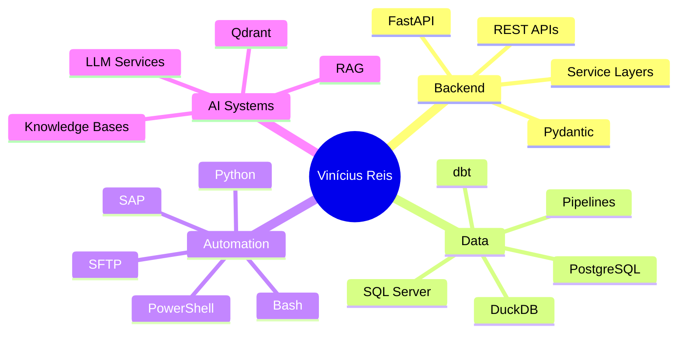

<p align="center">
  
</p>

<h3 align="center">
  I build backend, data and automation systems that turn messy operations into reliable software.
</h3>

<p align="center">
  <a href="mailto:viniciussport2004@gmail.com">
    
  </a>
  <a href="https://www.linkedin.com/in/vin%C3%ADcius-gon%C3%A7alves-reis-4544a921a?lipi=urn%3Ali%3Apage%3Ad_flagship3_profile_view_base_contact_details%3BeOlF79HGQICtD6MUyPINQQ%3D%3D">
    
  </a>
  <a href="https://github.com/venysssssssssss">
    
  </a>
</p>

<p align="center">
  
</p>

---

```txt
Vinícius Reis

Backend Developer.
Data Engineering student.
Python-first builder.

I work close to real business operations:
extracting data, automating flows, designing APIs,
building analytical backends and documenting systems
so they can survive outside the developer's head.
```

---

## Core



---

## Stack

<p align="center">
  
</p>

```txt
Python      FastAPI      DuckDB       dbt          PostgreSQL
SQL Server  Docker       Linux        Git          PowerShell
SFTP        APIs         RAG          Qdrant       Automation
```

---

## What I build

| Field | Direction |
|---|---|
| **Backend** | APIs, service layers, runners, control planes |
| **Data** | ELT pipelines, analytical datasets, validation layers |
| **Automation** | operational flows, extraction engines, batch processing |
| **AI** | RAG systems, document processing, local LLM workflows |
| **Docs** | Markdown-first documentation for technical continuity |

---

## Selected work

| Project | Focus |
|---|---|
| [`knowledge-base-refac`](https://github.com/venysssssssssss/knowledge-base-refac) | RAG architecture, document processing, Qdrant, Mistral, FastAPI |
| [`verihfy`](https://github.com/venysssssssssss/verihfy) | local AI correction platform, Next.js, Fastify, FastAPI, PostgreSQL |
| [`pypi-duck-flow`](https://github.com/venysssssssssss/pypi-duck-flow) | DuckDB-oriented data flow package direction |
| [`clickup-api`](https://github.com/venysssssssssss/clickup-api) | API integration and workflow automation |
| [`grafana-telegram-bot`](https://github.com/venysssssssssss/grafana-telegram-bot) | monitoring automation and notification flow |
| [`ssp-ba-data-analyze`](https://github.com/venysssssssssss/ssp-ba-data-analyze) | public data analysis and analytical processing |
| [`rust-crud-api-postgress`](https://github.com/venysssssssssss/rust-crud-api-postgress) | Rust API study with PostgreSQL |
| [`validate_excel_schema`](https://github.com/venysssssssssss/validate_excel_schema) | spreadsheet validation and schema control |

---

## GitHub signal

<p align="center">
  
  
</p>

<p align="center">
  
</p>

---

## Engineering principles

```txt
clarity over cleverness
traceability over guesswork
architecture over patchwork
automation over repetition
delivery over noise
```

---

<p align="center">
  
</p>

<p align="center">
  
</p>
